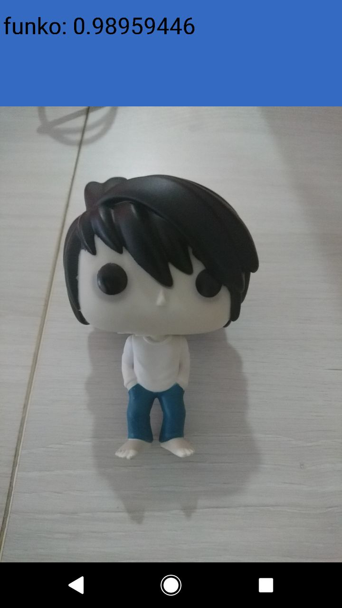

# Parte 1
## Setup

1. Instale mini-conda (mode default): [miniconda](https://conda.io/miniconda.html)

2. Se você está na pasta local deste repositório, digite o seguinte comando no terminal para criar um environment com todas as dependencias necessárias:

    2.1. Para Linux:
    ```markdown
        conda env create -f  environments/Linux/tensorflowEnvironmentLinux.yaml
    ```

    2.2. Para Mac:
    ```markdown
        conda env create -f  environments/Mac/tensorflowEnvironmentMac.yaml
    ```
    2.3 Para Windows:<br />
            Baixe e instale o docker:<br />
            [Docker para Windows](https://drive.google.com/file/d/12LIDIJnRttM2GwfMDUoOSaMrjfVOczfy/view?usp=sharing)
        
3. Para ativar e entrar no environment:
```markdown
    source activate tensorflowEnv
```

## Clonando o repositório

```markdown
    git clone https://github.com/larissalages/TensorFLow_Workshop.git
```

## Descomprimindo os datasets

A pasta datasets contém 4 bases de dados de imagens comprimidas. São elas:Funko, Pikachu, Moedas e Laptop. <br />
Descomprima os datasets que deseja usar no treinamento.

## Retreinando a rede

A rede pode ser retreinada com qualquer modelo pré-pronto da Google. Mas neste workshop vamos utilizar o MobileNet. Este modelo é otimizado para ser pequeno e eficiente, mas com o custo da precisão ser um pouco menor que a dos outros.
<br /> 
Você pode encontrar outros modelos pré-treinados neste repositório: [pre-trained-models](https://github.com/tensorflow/models/tree/master/research/slim#pre-trained-models).
<br />
<br />
Escolha uma das opções de resolução de imagem: 128,160,192, ou 224px. Melhores resoluções precisam de mais tempo de processamento, mas nem sempre resultam em uma acurácia melhor.
<br />
<br />
Na pasta do repositório, copie e cole no terminal as seguintes variáveis para configurar a rede:
```markdown
IMAGE_SIZE=224
ARCHITECTURE="mobilenet_1.0_${IMAGE_SIZE}"
```
## Executando o treinamento

Para começar a retreinar a rede, execute o seguinte comando:
```markdown
python -m scripts.retrain \
  --bottleneck_dir=tf_files/bottlenecks \
  --model_dir=tf_files/models/ \
  --summaries_dir=tf_files/training_summaries/"${ARCHITECTURE}" \
  --output_graph=tf_files/retrained_graph.pb \
  --output_labels=tf_files/retrained_labels.txt \
  --architecture="${ARCHITECTURE}" \
  --image_dir=datasets
```
Este script baixa o modelo pré-treinado, adiciona uma camada final e treina esta camada com os datasets escolhidos. <br />
O script vai gerar primeiramente todos os arquivos de bottleneck, que são todas as camadas antes da camada final, depois disso o treinamento da camada final começa. 
O script retrain escreve os dados nos seguintes arquivos:

**tf_files/retrained_graph.pb**: Contém uma versão do modelo selecionado com a camada final retreinada com as suas categorias. <br />
**tf_files/retrained_labels.txt**: Arquivo de texto contendo as labels.

## Testando o modelo

A pasta test_set contém algumas imagens para teste. Para testar todas as imagens da pasta no modelo, execute o seguinte comando:

```markdown
python test_all.py
```
Para testar uma imagem especifica, faça:
```markdown
python -m scripts.label_image \
    --graph=tf_files/retrained_graph.pb  \
    --image=path_para_imagem/nome_da_imagem
```
O script retrain tem várias outras opções de linha de comando que você pode usar para tentar aumentar a acurácia do modelo.
Você pode ler sobre essas opções no help do script:

```markdown
python -m scripts.retrain -h
```

## Otimizando o modelo para rodar em dispositivos móveis

Uma maneira pela qual a biblioteca TensorFlow é mantida pequena, para dispositivos móveis, é porque ela suporta apenas um subconjunto de operações que são comumente usadas durante a fase de validação e teste. Essa é uma abordagem razoável, já que o treinamento não é realizado nas plataformas móveis. Você pode ver a lista de operações suportadas no arquivo tensorflow/contrib/makefile/tf_op_files.txt.
<br />
Para evitar problemas causados por operações de treinamento não suportadas, a instalação do TensorFlow inclui uma ferramenta, optimize_for_inference, que remove tudo que não é necessário para um determinado conjunto de entradas e saídas.
O script também faz algumas outras otimizações que ajudam a acelerar o modelo. Ele pode acelerar em até 30%, dependendo do modelo de entrada. Veja como você executa o script:

```markdown
python -m tensorflow.python.tools.optimize_for_inference \
  --input=tf_files/retrained_graph.pb \
  --output=tf_files/optimized_graph.pb \
  --input_names="input" \
  --output_names="final_result"
```
Este script vai criar um novo arquivo em tf_files/optimized_graph.pb.<br />
O modelo treinado ainda tem em torno de 80 MB de tamanho. Esse tamanho ainda pode ser um fator limitante para o aplicativo que o inclua. A maior parte do espaço ocupado pelo modelo é pelos pesos, que são grandes blocos de números de ponto flutuante. Então, para fazer a compressão dos pesos, é utilizado o arquivo **quantize_graph.py**.

```markdown
python -m scripts.quantize_graph \
  --input=tf_files/optimized_graph.pb \
  --output=tf_files/rounded_graph.pb \
  --output_node_names=final_result \
  --mode=weights_rounded
```
# Android APP

Abra o Android Studio. Depois que ele carregar, selecione "Abrir um projeto existente do Android Studio".
No seletor de arquivos, escolha TensorFLow_Workshop/android/tfmobile. <br />
Se aparecer um pop-up "Gradle Sync", a primeira vez que abrir o projeto, clique OK".
<br />
Se o seu celular ainda não estiver com o modo desenvolvedor ativado, [siga estas instruções](http://www.techtudo.com.br/dicas-e-tutoriais/noticia/2014/10/como-ativar-o-modo-desenvolvedor-no-android.html).
<br />
Antes de fazer qualquer alteração no aplicativo, vamos executar a versão que acompanha o repositório.
Execute uma sincronização Gradle e, em seguida, pressione play no Android Studio para iniciar o processo de criação e instalação.
Quando o APP estiver instalado, clique no ícone do aplicativo, para iniciá-lo. Esta versão do aplicativo usa o modelo MobileNet, pré-treinado com as 1000 categorias do ImageNet. 

## Modificando o APP para funcionar com o nosso modelo

Substitua os arquivos graph.pb e labels.txt do MobileNet, que estão no diretório android/tfmobile/assets, pela versão otimizada do nosso modelo. O seguinte comando realiza essa tarefa:
```markdown
    cp tf_files/rounded_graph.pb android/tfmobile/assets/graph.pb
    cp tf_files/retrained_labels.txt android/tfmobile/assets/labels.txt 
```
## Altere o output_name na classe ClassifierActivity.java

O aplicativo está atualmente configurado para ler a saída da MobileNet, chamada "MobilenetV1/Predictions/Softmax". O nó de saída do nosso modelo tem um nome diferente: "final_result". Abra ClassifierActivity.java e atualize a variável OUTPUT_NAME da seguinte forma:

```markdown
  private static final String INPUT_NAME = "input";
  private static final String OUTPUT_NAME = "final_result";
```

## Altere as dependencias do Build Gradle

Dentro de Gradle Scripts, em build.gradle, troque:

```markdown
compile 'org.tensorflow:tensorflow-android:1.2.0-preview'
```
por
```markdown
compile 'org.tensorflow:tensorflow-android:1.5.0'
```

## Execute o app:

No Android Studio, execute o Gradle sync, para que o sistema de compilação possa localizar seus arquivos e, em seguida, clique em play, para iniciar o processo de compilação e instalação como antes.

O APP deve ser algo como na figura:
<br />
<br />

<br />
<br />

# Parte 2: Artistic style transfer

Este projeto é uma implementação do artigo [A Learned Representation For Artistic Style](https://arxiv.org/abs/1610.07629).

## O APP

## Implementando
Primeiro clone o repositorio:

```markdown
git clone https://github.com/larissalages/style-transfer-android.git
```
Carregue o código no Android Studio: <br />
    1. Abra o Android Studio e selecione Import Project, navegue pelos diretórios até encontrar o repositório clonado.<br />
    2. Você DEVE aceitar a sugestão de usar o Gradle wrapper e recusar o Instant Run.<br />
    3. Assim que terminar de importar o projeto, abra o arquivo **StylizeActivity**.
    
O código original do TensorFlow que gerou esta rede está disponível [nesta página do GitHub](https://github.com/tensorflow/magenta). Antes de usá-lo em um ambiente com recursos restritos, como um aplicativo móvel, esse modelo foi exportado e transformado para usar tipos de dados menores e remover cálculos redundantes. O resultado final é o arquivo **stylize_quantized.pb** que será usado neste app.

Para adicionar as bibliotecas de inferência e suas dependências ao nosso projeto, precisamos adicionar a Biblioteca de inferências Android TensorFlow e a API Java, que está disponível no JCenter (em Arquivos, tensorflow-android)
1. No Android Studio abra o build.gradle <br />
2. Adicione o seguinte código ao arquivo:
```markdown
dependencies {
   compile 'org.tensorflow:tensorflow-android:1.5.0'
}
```
Clique no botão Gradle Sync para permitir as mudanças dentro da IDE.

Logo depois da declaração da classe StylizeActivity, e antes de "private static final int NUM_STYLES = 26;" coloque o seguinte codigo
```markdown
private TensorFlowInferenceInterface inferenceInterface;

private static final String MODEL_FILE = "file:///android_asset/stylize_quantized.pb";

private static final String INPUT_NODE = "input";
private static final String STYLE_NODE = "style_num";

private static final String OUTPUT_NODE = "transformer/expand/conv3/conv/Sigmoid";
```
Na mesma classe, ache o método **onPreviewSizeChosen** e crie um objeto da classe **TensorFlowInferenceInterface**. Este objeto vai ser usado para inicialização e vai ser chamado uma vez que todas as permissões forem concedidas ao sistema de arquivos e à câmera.

```markdown
@Override
public void onPreviewSizeChosen(final Size size, final int rotation) {
 //copie e cole esta linha
 inferenceInterface = new TensorFlowInferenceInterface(getAssets(), MODEL_FILE);

}
```
Ainda na classe StylizeActivity.java, dentro do método **stylizeImage**, adicione o código para passar o bitmap da nossa câmera e os estilos escolhidos para o TensorFlow e pegue a saída do gráfico.
```markdown
 // Copy the input data into TensorFlow.
 inferenceInterface.feed(INPUT_NODE, floatValues, 
   1, bitmap.getWidth(), bitmap.getHeight(), 3);
 inferenceInterface.feed(STYLE_NODE, styleVals, NUM_STYLES);

 // Execute the output node's dependency sub-graph.
 inferenceInterface.run(new String[] {OUTPUT_NODE}, isDebug());

 // Copy the data from TensorFlow back into our array.
 inferenceInterface.fetch(OUTPUT_NODE, floatValues);

}
```
**Opcional**: Localize renderDebug e inclua o texto de status do TensorFlow (acionada quando você pressiona as teclas de volume).

```markdown
private void renderDebug(final Canvas canvas) {
 // ... provided code that does some drawing ...

 // Look for this line, but don't copy it, it's already there.
 final Vector<String> lines = new Vector<>();

 // Add these three lines right here:
 final String[] statLines = inferenceInterface.getStatString().split("\n");
 Collections.addAll(lines, statLines);
 lines.add("");

 // Don't add this line, it's already there
 lines.add("Frame: " + previewWidth + "x" + previewHeight);
 // ... more provided code for rendering the text ...
}
```

