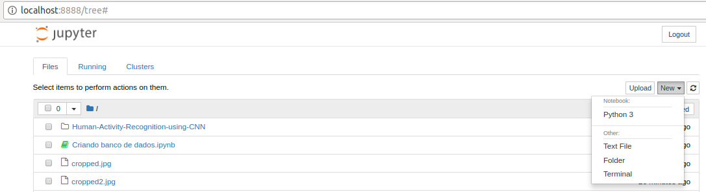
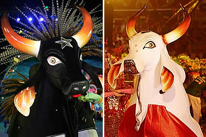
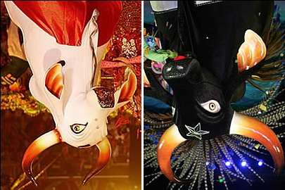
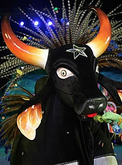
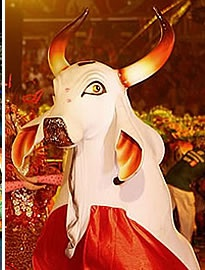

# Parte 1
## Setup

1. Instale mini-conda (mode default): [miniconda](https://conda.io/miniconda.html)

2. Se você está na pasta local deste repositório, digite o seguinte comando no terminal para criar um environment com todas as dependencias necessárias:

    2.1. Para Linux:
    ```markdown
        conda env create -f  environments/Linux/tensorflowEnvironmentLinux.yaml
    ```

    2.2. Para Mac:
    ```markdown
        conda env create -f  environments/Mac/tensorflowEnvironmentMac.yaml
    ```
    2.3 Para Windows:<br />
            Baixe e instale o docker:<br />
            [Docker para Windows](https://drive.google.com/file/d/12LIDIJnRttM2GwfMDUoOSaMrjfVOczfy/view?usp=sharing)
        
3. Para ativar e entrar no environment:
```markdown
    source activate tensorflowEnv
```

## Clonando o repositório

```markdown
    git clone https://github.com/larissalages/TensorFLow_Workshop.git
```

## Descomprimindo os datasets

A pasta datasets contém 4 bases de dados de imagens comprimidas. São elas:Funko, Pikachu, Moedas e Laptop. <br />
Descomprima os datasets que deseja usar no treinamento.

## Retreinando a rede

A rede pode ser retreinada com qualquer modelo pré-pronto da Google. Mas neste workshop vamos utilizar o MobileNet. Este modelo é otimizado para ser pequeno e eficiente, mas com o custo da precisão ser um pouco menor que a dos outros.
<br /> 
Você pode encontrar outros modelos pré-treinados neste repositório: [pre-trained-models](https://github.com/tensorflow/models/tree/master/research/slim#pre-trained-models).
<br />
<br />
Escolha uma das opções de resolução de imagem: 128,160,192, ou 224px. Melhores resoluções precisam de mais tempo de processamento, mas nem sempre resultam em uma acurácia melhor.
<br />
<br />
Na pasta do repositório, copie e cole no terminal as seguintes variáveis para configurar a rede:
```markdown
IMAGE_SIZE=224
ARCHITECTURE="mobilenet_1.0_${IMAGE_SIZE}"
```
## Executando o treinamento

Para começar a retreinar a rede, execute o seguinte comando:
```markdown
python -m scripts.retrain \
  --bottleneck_dir=tf_files/bottlenecks \
  --model_dir=tf_files/models/ \
  --summaries_dir=tf_files/training_summaries/"${ARCHITECTURE}" \
  --output_graph=tf_files/retrained_graph.pb \
  --output_labels=tf_files/retrained_labels.txt \
  --architecture="${ARCHITECTURE}" \
  --image_dir=datasets
```
Este script baixa o modelo pré-treinado, adiciona uma camada final e treina esta camada com os datasets escolhidos. <br />
O script vai gerar primeiramente todos os arquivos de bottleneck, que são todas as camadas antes da camada final, depois disso o treinamento da camada final começa. 
O script retrain escreve os dados nos seguintes arquivos:

**tf_files/retrained_graph.pb**: Contém uma versão do modelo selecionado com a camada final retreinada com as suas categorias. <br />
**tf_files/retrained_labels.txt**: Arquivo de texto contendo as labels.

## Testando o modelo

A pasta test_set contém algumas imagens para teste. Para testar todas as imagens da pasta no modelo, execute o seguinte comando:

```markdown
python test_all.py
```
Para testar uma imagem especifica, faça:
```markdown
python -m scripts.label_image \
    --graph=tf_files/retrained_graph.pb  \
    --image=path_para_imagem/nome_da_imagem
```
O script retrain tem várias outras opções de linha de comando que você pode usar para tentar aumentar a acurácia do modelo.
Você pode ler sobre essas opções no help do script:

```markdown
python -m scripts.retrain -h
```

## Otimizando o modelo para rodar em dispositivos móveis

Uma maneira pela qual a biblioteca TensorFlow é mantida pequena, para dispositivos móveis, é porque ela suporta apenas um subconjunto de operações que são comumente usadas durante a fase de validação e teste. Essa é uma abordagem razoável, já que o treinamento não é realizado nas plataformas móveis. Você pode ver a lista de operações suportadas no arquivo tensorflow/contrib/makefile/tf_op_files.txt.
<br />
Para evitar problemas causados por operações de treinamento não suportadas, a instalação do TensorFlow inclui uma ferramenta, optimize_for_inference, que remove tudo que não é necessário para um determinado conjunto de entradas e saídas.
O script também faz algumas outras otimizações que ajudam a acelerar o modelo. Ele pode acelerar em até 30%, dependendo do modelo de entrada. Veja como você executa o script:

```markdown
python -m tensorflow.python.tools.optimize_for_inference \
  --input=tf_files/retrained_graph.pb \
  --output=tf_files/optimized_graph.pb \
  --input_names="input" \
  --output_names="final_result"
```
Este script vai criar um novo arquivo em tf_files/optimized_graph.pb.<br />
O modelo treinado ainda tem em torno de 80 MB de tamanho. Esse tamanho ainda pode ser um fator limitante para o aplicativo que o inclua. A maior parte do espaço ocupado pelo modelo é pelos pesos, que são grandes blocos de números de ponto flutuante. Então, para fazer a compressão dos pesos, é utilizado o arquivo **quantize_graph.py**.

```markdown
python -m scripts.quantize_graph \
  --input=tf_files/optimized_graph.pb \
  --output=tf_files/rounded_graph.pb \
  --output_node_names=final_result \
  --mode=weights_rounded
```
# Android APP

Abra o Android Studio. Depois que ele carregar, selecione "Abrir um projeto existente do Android Studio".
No seletor de arquivos, escolha TensorFLow_Workshop/android/tfmobile. <br />
Se aparecer um pop-up "Gradle Sync", a primeira vez que abrir o projeto, clique OK".
<br />
Se o seu celular ainda não estiver com o modo desenvolvedor ativado, [siga estas instruções](http://www.techtudo.com.br/dicas-e-tutoriais/noticia/2014/10/como-ativar-o-modo-desenvolvedor-no-android.html).
<br />
Antes de fazer qualquer alteração no aplicativo, vamos executar a versão que acompanha o repositório.
Execute uma sincronização Gradle e, em seguida, pressione play no Android Studio para iniciar o processo de criação e instalação.
Quando o APP estiver instalado, clique no ícone do aplicativo, para iniciá-lo. Esta versão do aplicativo usa o modelo MobileNet, pré-treinado com as 1000 categorias do ImageNet. 

## Modificando o APP para funcionar com o nosso modelo

Substitua os arquivos graph.pb e labels.txt do MobileNet, que estão no diretório android/tfmobile/assets, pela versão otimizada do nosso modelo. O seguinte comando realiza essa tarefa:
```markdown
    cp tf_files/rounded_graph.pb android/tfmobile/assets/graph.pb
    cp tf_files/retrained_labels.txt android/tfmobile/assets/labels.txt 
```
## Altere o output_name na classe ClassifierActivity.java

O aplicativo está atualmente configurado para ler a saída da MobileNet, chamada "MobilenetV1/Predictions/Softmax". O nó de saída do nosso modelo tem um nome diferente: "final_result". Abra ClassifierActivity.java e atualize a variável OUTPUT_NAME da seguinte forma:

```markdown
  private static final String INPUT_NAME = "input";
  private static final String OUTPUT_NAME = "final_result";
```

## Altere as dependencias do Build Gradle

Dentro de Gradle Scripts, em build.gradle, troque:

```markdown
compile 'org.tensorflow:tensorflow-android:1.2.0-preview'
```
por
```markdown
compile 'org.tensorflow:tensorflow-android:1.5.0'
```

## Execute o app:

No Android Studio, execute o Gradle sync, para que o sistema de compilação possa localizar seus arquivos e, em seguida, clique em play, para iniciar o processo de compilação e instalação como antes.

O APP deve ser algo como na figura:
<br />
<br />

<br />
<br />
# Parte 2: Criando um banco de dados
Instruções de manipulação básica de imagens, para criação de um banco para treinamento da rede.

## Instalação
<br/>
Ative novamente o diretórtio, na pasta miniconda/bin digite:

```markdown
source activate tensorflowEnv
```

- Crie um diretorio para salvar suas imagens
- Pelo terminal do ambiente acesse esse diretório
- Ainda no terminal digite:
```markdown
jupyter notebook
```
O Jupyter irá gerar um link, que você deve copiar e colar dentro do navegado. <br />
Já dentro do navegador, no canto direito de da página selecione:
New -> terminal
<br />

<br />


No terminal digite:
```markdown
bash
```
Então iremos instalar o OpenCv ( que é uma biblioteca de manipulação de imagens), digite:
```markdown
conda install -c conda-forge opencv
```

Ao finalizar a instalação volte para a página principal, e no lado direito selecione:
new-> python 
<br />

<br />

Uma página com interação no python irá abrir (este é o notebook).
- O primeiro passo é importar a bibliotecas que iremos precisar.

```markdown
import  cv2
import matplotlib.pyplot as plt
import matplotlib.image as mpimg
```

- Em seguida abrir a imagem para manipula-la

```markdown
img=mpimg.imread('ensaiosbumbas.jpg')
plt.imshow(img)
```
<br />

<br /> 

## Redimensionando a imagem

Em alguns casos uma imagem muito grande é um problema para o aprendizado da rede. E nesse caso se faz necessário redimensionar a imagem.

- Para abrir a imagem com o OpenCv e visualizar as dimensões basta digitar o código abaixo:
```markdown
image = cv2.imread('ensaiosbumbas.jpg')
image.shape
```
- Para abrir a imagem com o OpenCv e visualizar o as dimensões da imagem basta digitar o código abaixo:
```markdown
image = cv2.imread('ensaiosbumbas.jpg')
image.shape
```
Antes de redimensionar uma imagem precisamos levar em consideração a proporção da imagem, assim não iremos alterar o formato
original da imagem.
<br />
No caso abaixo, estamos colocando a imagem para 100px de largura, mas para isso precisamos primeiro calcular o ratio da imagem. A proporção entre a altura e a largura. 
<br />
r é igual 100px / pela altura
<br />
A dimensão da imagem final ficará 100px de largura e altura vezes o 'r' encontrado.

```markdown
r = 100.0 / image.shape[1]
dim = (100, int(image.shape[0] * r))
```
Com o comando abaixo, executamos de fato a redimensão da imagem, os argumentos passados são: a imagem, nova dimensão e o algoritmo a ser utilizado para redimencionar a imagem.

```markdown
resized = cv2.resize(image, dim, interpolation = cv2.INTER_AREA)
cv2.imwrite("resized.jpg", resized)
```
Para vizualizar as modificações digite:

```markdown
mimg=mpimg.imread('resized.jpg')
plt.imshow(mimg)
```

<br />

<br />

## Rotacionado a imagem

Outro passo importante na criação de um banco de imagens é que o classificador deve ser capaz de reconhecer seu objeto por exemplo de todos os angulos. Então montar uma base de dados com imagens rotacionadas pode ajudar na classificação.

Salve as dimensões da imagem em um variável, e calcule o centro da imagem, simplesmente dividindo altura e largura por 2. 

```markdown
(h, w) = image.shape[:2]
center = (w / 2, h / 2)
```
"getRotationMatrix"  o primeiro argumento é o centro da image que computamos. Se quisessemos que a imagem rotacionasse sobre algum ponto arbritrário o esse ponto seria inserido aqui.  O segundo argumeto é o ângulo de rotação (em graus). E por último o fator escalar. Neste caso 1.0 mantém a imagem no tamanho original, se quisessemos diminuir a imagem podemos colocar 0.5 ou para aumentar 2.0. Agora insira o código abaixo:

```markdown
M = cv2.getRotationMatrix2D(center, 180, 1.0)
rotated = cv2.warpAffine(image, M, (w, h))
cv2.imwrite("rotated.jpg", rotated)
```
Observe que o a rotaçao só ocorre quando chamamos a função warpAffine, que recebe a imagem, os parêmetros de rotação, e as dimensões da imagem.

<br />
Para visualizar a mudança digite: 

```markdown
mimg=mpimg.imread('rotated.jpg')
plt.imshow(mimg)
```

<br />

<br />

## Selecionando a região de interesse

É comum que o todo de uma imagem não represente o único objeto que queremos classificar. Por isso, "recortar" a região de interesse é um procedimento comum no pré-processamento de imagens.

Para isso digite o comando abaixo, lembrando que você deve indicar o local de "recorte" da imagem.
```markdown
cropped = image[X_inicio:X_fim, Y_inicio:Y_fim]
cv2.imwrite("cropped1.jpg", cropped)
```
<br />
Para visualizar o crop digite: 

```markdown
mimg=mpimg.imread('cropped1.jpg')
plt.imshow(mimg)
```

<br />

<br />

<br />


# Parte 3: Artistic style transfer

Este projeto é uma implementação do artigo [A Learned Representation For Artistic Style](https://arxiv.org/abs/1610.07629).

## O APP
<br />

<br />

- O primeiro botão, rotulado com um número (256 por padrão), controla o tamanho da imagem a ser exibida Números menores significam imagens menores, que serão mais rápidas de transformar, mas terão qualidade inferior. Por outro lado, as imagens maiores conterão mais detalhes, mas levarão mais tempo para serem transformadas.
- O segundo botão salvará o quadro atual no seu dispositivo para você usar posteriormente.
- As miniaturas representam os possíveis estilos que você pode usar para transformar o feed da câmera. Cada imagem é um controle deslizante e você pode combinar vários controles deslizantes que representarão as proporções de cada estilo que você deseja aplicar. Essas proporções, junto com o frame da câmera, representam as entradas na rede.

## Implementando
Primeiro clone o repositorio:

```markdown
git clone https://github.com/larissalages/style-transfer-android.git
```
Carregue o código no Android Studio: <br />
    1. Abra o Android Studio e selecione Import Project, navegue pelos diretórios até encontrar o repositório clonado.<br />
    2. Você DEVE aceitar a sugestão de usar o Gradle wrapper e recusar o Instant Run.<br />
    3. Assim que terminar de importar o projeto, abra o arquivo **StylizeActivity**.
    
O código original do TensorFlow que gerou esta rede está disponível [nesta página do GitHub](https://github.com/tensorflow/magenta). Antes de usá-lo em um ambiente com recursos restritos, como um aplicativo móvel, esse modelo foi exportado e transformado para usar tipos de dados menores e remover cálculos redundantes. O resultado final é o arquivo **stylize_quantized.pb** que será usado neste app.
<br />
A câmera fornece dados de imagem no espaço **YUV** (como é o mais amplamente suportado), mas a rede espera **RGB**. Para realizar essa conversão e para toda as outras transformações necessárias para as imagens é utilizada a biblioteca **ImageUtils**. Neste código também é bastante utilizada a classe **TensorFlowInferenceInterface**, que é uma interface para modelo de programação de baixo nível.
<br />
<br />
Para adicionar as bibliotecas de inferência e suas dependências ao nosso projeto, precisamos adicionar a Biblioteca de inferências Android TensorFlow e a API Java, que está disponível no JCenter (em Arquivos, tensorflow-android)
1. No Android Studio abra o build.gradle <br />
2. Adicione o seguinte código ao arquivo:
```markdown
dependencies {
   compile 'org.tensorflow:tensorflow-android:1.5.0'
}
```
Clique no botão Gradle Sync para permitir as mudanças dentro da IDE.

Logo depois da declaração da classe StylizeActivity, e antes de "private static final int NUM_STYLES = 26;" coloque o seguinte codigo
```markdown
private TensorFlowInferenceInterface inferenceInterface;

private static final String MODEL_FILE = "file:///android_asset/stylize_quantized.pb";

private static final String INPUT_NODE = "input";
private static final String STYLE_NODE = "style_num";

private static final String OUTPUT_NODE = "transformer/expand/conv3/conv/Sigmoid";
```
Na mesma classe, ache o método **onPreviewSizeChosen** e crie um objeto da classe **TensorFlowInferenceInterface**. Este objeto vai ser usado para inicialização e vai ser chamado uma vez que todas as permissões forem concedidas ao sistema de arquivos e à câmera.

```markdown
@Override
public void onPreviewSizeChosen(final Size size, final int rotation) {
 //copie e cole esta linha
 inferenceInterface = new TensorFlowInferenceInterface(getAssets(), MODEL_FILE);

}
```
Ainda na classe StylizeActivity.java, dentro do método **stylizeImage**, adicione o código para passar o bitmap da nossa câmera e os estilos escolhidos para o TensorFlow e pegue a saída do gráfico.
```markdown
 // Copy the input data into TensorFlow.
 inferenceInterface.feed(INPUT_NODE, floatValues, 
   1, bitmap.getWidth(), bitmap.getHeight(), 3);
 inferenceInterface.feed(STYLE_NODE, styleVals, NUM_STYLES);

 // Execute the output node's dependency sub-graph.
 inferenceInterface.run(new String[] {OUTPUT_NODE}, isDebug());

 // Copy the data from TensorFlow back into our array.
 inferenceInterface.fetch(OUTPUT_NODE, floatValues);

}
```
**Opcional**: Localize renderDebug e inclua o texto de status do TensorFlow (acionada quando você pressiona as teclas de volume).

```markdown
private void renderDebug(final Canvas canvas) {
 // ... provided code that does some drawing ...

 // Look for this line, but don't copy it, it's already there.
 final Vector<String> lines = new Vector<>();

 // Add these three lines right here:
 final String[] statLines = inferenceInterface.getStatString().split("\n");
 Collections.addAll(lines, statLines);
 lines.add("");

 // Don't add this line, it's already there
 lines.add("Frame: " + previewWidth + "x" + previewHeight);
 // ... more provided code for rendering the text ...
}
```
No Android Studio, pressione o botão Executar e aguarde a construção do projeto.
